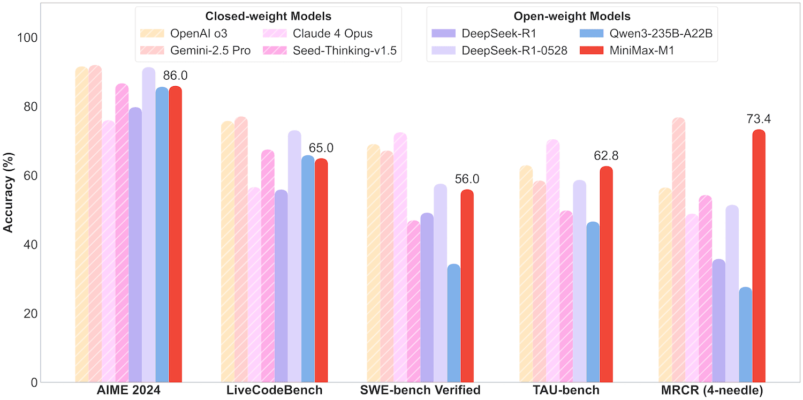

<div align="center">
  <picture>
    <source srcset="figures/MiniMaxLogo-Dark.png" media="(prefers-color-scheme: dark)">
      
    </source>
  </picture>
</div>
<hr>

<div align="center" style="line-height: 1;">
  <a href="https://www.minimax.io" target="_blank" style="margin: 2px;">
    
  </a>
  <a href="https://arxiv.org/abs/2506.13585" target="_blank" style="margin: 2px;">
    
  </a>
  <a href="https://chat.minimax.io/" target="_blank" style="margin: 2px;">
    
  </a>
  <a href="https://www.minimax.io/platform" style="margin: 2px;">
    
  </a>
  <a href="https://github.com/MiniMax-AI/MiniMax-MCP" style="margin: 2px;">
    
  </a>
</div>
<div align="center" style="line-height: 1;">
  <a href="https://huggingface.co/MiniMaxAI" target="_blank" style="margin: 2px;">
    
  </a>
  <a href="https://github.com/MiniMax-AI/MiniMax-M1" target="_blank" style="margin: 2px;">
    
  </a>
  <a href="https://www.modelscope.cn/organization/MiniMax" target="_blank" style="margin: 2px;">
    
  </a>
  <a href="https://github.com/MiniMax-AI/MiniMax-M1/blob/main/LICENSE" style="margin: 2px;">
    
  </a>
  <a href="https://github.com/MiniMax-AI/MiniMax-AI.github.io/blob/main/images/wechat-qrcode.jpeg" target="_blank" style="margin: 2px;">
    
  </a>
</div>

# MiniMax-M1

## 1. Model Overview 

We introduce MiniMax-M1, the world's first open-weight, large-scale hybrid-attention reasoning model.
MiniMax-M1 is powered by a hybrid Mixture-of-Experts (MoE) architecture combined with a lightning
attention mechanism. The model is developed based on our previous [MiniMax-Text-01 model](https://huggingface.co/MiniMaxAI/MiniMax-Text-01), 
which contains a total of 456 billion parameters with 45.9 billion parameters activated
per token. Consistent with MiniMax-Text-01, the M1 model natively supports a context length of 1
million tokens, 8x the context size of DeepSeek R1. Furthermore, the lightning attention mechanism
in MiniMax-M1 enables efficient scaling of test-time compute – For example, compared to DeepSeek
R1, M1 consumes 25% of the FLOPs at a generation length of 100K tokens. These properties make M1
particularly suitable for complex tasks that require processing long inputs and thinking extensively.
MiniMax-M1 is trained using large-scale reinforcement learning (RL) on diverse problems ranging from
traditional mathematical reasoning to sandbox-based, real-world software engineering environments.
We develop an efficient RL scaling framework for M1 highlighting two perspectives: (1) We propose
CISPO, a novel algorithm that clips importance sampling weights instead of token updates, which
outperforms other competitive RL variants; (2) Our hybrid-attention design naturally enhances the
efficiency of RL, where we address unique challenges when scaling RL with the hybrid architecture. We
train two versions of MiniMax-M1 models with [40K](https://huggingface.co/MiniMaxAI/MiniMax-M1-40k) and 
[80K](https://huggingface.co/MiniMaxAI/MiniMax-M1-80k) thinking budgets respectively. Experiments
on standard benchmarks show that our models outperform other strong open-weight models such as
the original DeepSeek-R1 and Qwen3-235B, particularly on complex software engineering, tool using,
and long context tasks. With efficient scaling of test-time compute, MiniMax-M1 serves as a strong
foundation for next-generation language model agents to reason and tackle real-world challenges. 

<p align="center">
  
  <br>
  <small><em>Benchmark performance comparison of leading commercial and open-weight models across competition-level mathematics, coding, software engineering, agentic tool use, and long-context understanding tasks. We use the MiniMax-M1-80k model here for MiniMax-M1.</em></small>
</p>


## 2. Evaluation

**Performance of MiniMax-M1 on core benchmarks.**


| **Category** | **Task** | **MiniMax-M1-80K** | **MiniMax-M1-40K** | **Qwen3-235B-A22B** | **DeepSeek-R1-0528** | **DeepSeek-R1** | **Seed-Thinking-v1.5** | **Claude 4 Opus** | **Gemini 2.5 Pro (06-05)** | **OpenAI-o3** |
|:---|:---|:---:|:---:|:---:|:---:|:---:|:---:|:---:|:---:|:---:|
| | *Extended Thinking* | *80K* | *40K* | *32k* | *64k* | *32k* | *32k* | *64k* | *64k* | *100k* |
| ***Mathematics*** | AIME 2024 | 86.0 | 83.3 | 85.7 | 91.4 | 79.8 | 86.7 | 76.0 | 92.0 | 91.6 |
| | AIME 2025 | 76.9 | 74.6 | 81.5 | 87.5 | 70.0 | 74.0 | 75.5 | 88.0 | 88.9 |
| | MATH-500 | 96.8 | 96.0 | 96.2 | 98.0 | 97.3 | 96.7 | 98.2 | 98.8 | 98.1 |
| ***General Coding*** | LiveCodeBench *(24/8~25/5)* | 65.0 | 62.3 | 65.9 | 73.1 | 55.9 | 67.5 | 56.6 | 77.1 | 75.8 |
| | FullStackBench | 68.3 | 67.6 | 62.9 | 69.4 | 70.1 | 69.9 | 70.3 | -- | 69.3 |
| ***Reasoning & Knowledge***| GPQA Diamond | 70.0 | 69.2 | 71.1 | 81.0 | 71.5 | 77.3 | 79.6 | 86.4 | 83.3 |
| | HLE *(no tools)* | 8.4\* | 7.2\* | 7.6\* | 17.7\* | 8.6\* | 8.2 | 10.7 | 21.6 | 20.3 |
| | ZebraLogic | 86.8 | 80.1 | 80.3 | 95.1 | 78.7 | 84.4 | 95.1 | 91.6 | 95.8 |
| | MMLU-Pro | 81.1 | 80.6 | 83.0 | 85.0 | 84.0 | 87.0 | 85.0 | 86.0 | 85.0 |
| ***Software Engineering***| SWE-bench Verified| 56.0 | 55.6 | 34.4 | 57.6 | 49.2 | 47.0 | 72.5 | 67.2 | 69.1 |
| ***Long Context*** | OpenAI-MRCR *(128k)* | 73.4 | 76.1 | 27.7 | 51.5 | 35.8 | 54.3 | 48.9 | 76.8 | 56.5 |
| | OpenAI-MRCR *(1M)* | 56.2 | 58.6 | -- | -- | -- | -- | -- | 58.8 | -- |
| | LongBench-v2 | 61.5 | 61.0 | 50.1 | 52.1 | 58.3 | 52.5 | 55.6 | 65.0 | 58.8 |
| ***Agentic Tool Use***| TAU-bench *(airline)* | 62.0 | 60.0 | 34.7 | 53.5 | -- | 44.0 | 59.6 | 50.0 | 52.0 |
| | TAU-bench *(retail)* | 63.5 | 67.8 | 58.6 | 63.9 | -- | 55.7 | 81.4 | 67.0 | 73.9 |
| ***Factuality*** | SimpleQA | 18.5 | 17.9 | 11.0 | 27.8 | 30.1 | 12.9 | -- | 54.0 | 49.4 |
| ***General Assistant***| MultiChallenge | 44.7 | 44.7 | 40.0 | 45.0 | 40.7 | 43.0 | 45.8 | 51.8 | 56.5 |

\* conducted on the text-only HLE subset.

Our models are evaluated with `temperature=1.0`, `top_p=0.95`. 

### SWE-bench methodology 
We report results derived from the Agentless scaffold. Departing from the original pipeline, our methodology employs a two-stage localization process (without any embedding-based retrieval mechanisms): initial coarse-grained file localization followed by fine-grained localization to specific files and code elements. The values for our models are calculated on the subset of n=486 verified tasks which work on our infrastructure. The excluded 14 test cases that were incompatible with our internal infrastructure are:
`"astropy__astropy-7606"`,
`"astropy__astropy-8707"`,
`"astropy__astropy-8872"`,
`"django__django-10097"`,
`"matplotlib__matplotlib-20488"`,
`"psf__requests-2317"`,
`"psf__requests-2931"`,
`"psf__requests-5414"`,
`"pylint-dev__pylint-6528"`,
`"pylint-dev__pylint-7277"`,
`"sphinx-doc__sphinx-10435"`,
`"sphinx-doc__sphinx-7985"`,
`"sphinx-doc__sphinx-8269"`,
`"sphinx-doc__sphinx-8475"`

### TAU-bench methodology 
We evaluate TAU-Bench with GPT-4.1 as user model and without any custom tools. The maximum number of interaction steps is 40. 
Our general system prompt is: 
```
- In each round, you need to carefully examine the tools provided to you to determine if any can be used.
- You must adhere to all of the policies. Pay attention to the details in the terms. Solutions for most situations can be found within these policies.
``` 

## 3. Recommendations for Minimax-M1 Model Usage

To achieve the best results with the Minimax-M1 model, we suggest focusing on two key points: Inference Parameters and the System Prompt.

### 3.1. Inference Parameters
- Temperature: **`1.0`**
- Top_p: **`0.95`**

This setting is optimal for encouraging creativity and diversity in the model's responses. It allows the model to explore a wider range of linguistic possibilities, preventing outputs that are too rigid or repetitive, while still maintaining strong logical coherence.

### 3.2. System Prompt
Tailoring your system prompt to the specific task is crucial for guiding the model effectively. Below are suggested settings for different scenarios.

#### A. General-Purpose Scenarios
For common tasks like summarization, translation, Q&A, or creative writing:
```
You are a helpful assistant.
```
#### B. Web Development Scenarios
For complex tasks like generating code for web pages:
``` 
You are a web development engineer, writing web pages according to the instructions below. You are a powerful code editing assistant capable of writing code and creating artifacts in conversations with users, or modifying and updating existing artifacts as requested by users. 
All code is written in a single code block to form a complete code file for display, without separating HTML and JavaScript code. An artifact refers to a runnable complete code snippet, you prefer to integrate and output such complete runnable code rather than breaking it down into several code blocks. For certain types of code, they can render graphical interfaces in a UI window. After generation, please check the code execution again to ensure there are no errors in the output.
Output only the HTML, without any additional descriptive text. Make the UI looks modern and beautiful.
```
#### C. Mathematical Scenarios
When dealing with problems that require calculation or logical deduction:
```
Please reason step by step, and put your final answer within \boxed{}.
```

## 4. Deployment Guide

Download the model from HuggingFace repository: 
- [MiniMax-M1-40k](https://huggingface.co/MiniMaxAI/MiniMax-M1-40k)
- [MiniMax-M1-80k](https://huggingface.co/MiniMaxAI/MiniMax-M1-80k)

For production deployment, we recommend using [vLLM](https://docs.vllm.ai/en/latest/) to serve MiniMax-M1. vLLM provides excellent performance for serving large language models with the following features:
- 🔥 Outstanding service throughout performance
- ⚡ Efficient and intelligent memory management
- 📦 Powerful batch request processing capability
- ⚙️ Deeply optimized underlying performance

For detailed vLLM deployment instructions, please refer to our [vLLM Deployment Guide](./docs/vllm_deployment_guide.md).
Alternatively, you can also deploy using Transformers directly. For detailed Transformers deployment instructions, you can see our [MiniMax-M1 Transformers Deployment Guide](./docs/transformers_deployment_guide.md).


## 5. Function Calling

The MiniMax-M1 model supports function calling capabilities, enabling the model to identify when external functions need to be called and output function call parameters in a structured format. [MiniMax-M1 Function Call Guide](./docs/function_call_guide.md) provides detailed instructions on how to use the function calling feature of MiniMax-M1.


## 6. Chatbot & API
For general use and evaluation, we provide a [Chatbot](https://chat.minimax.io/) with online search capabilities and the [online API](https://www.minimax.io/platform/) for developers. For general use and evaluation, we provide the [MiniMax MCP Server](https://github.com/MiniMax-AI/MiniMax-MCP) with video generation, image generation, speech synthesis, and voice cloning for developers.


## 7. Citation
```
@misc{minimax2025minimaxm1scalingtesttimecompute,
      title={MiniMax-M1: Scaling Test-Time Compute Efficiently with Lightning Attention}, 
      author={MiniMax},
      year={2025},
      eprint={2506.13585},
      archivePrefix={arXiv},
      primaryClass={cs.CL},
      url={https://arxiv.org/abs/2506.13585}, 
}
```

## 8. Contact Us
Contact us at [model@minimax.io](mailto:model@minimax.io).